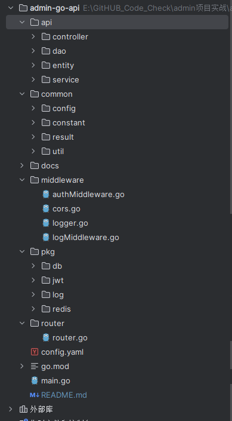
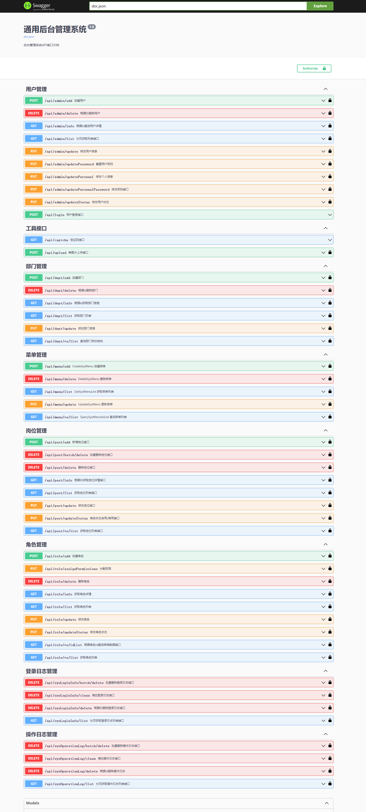
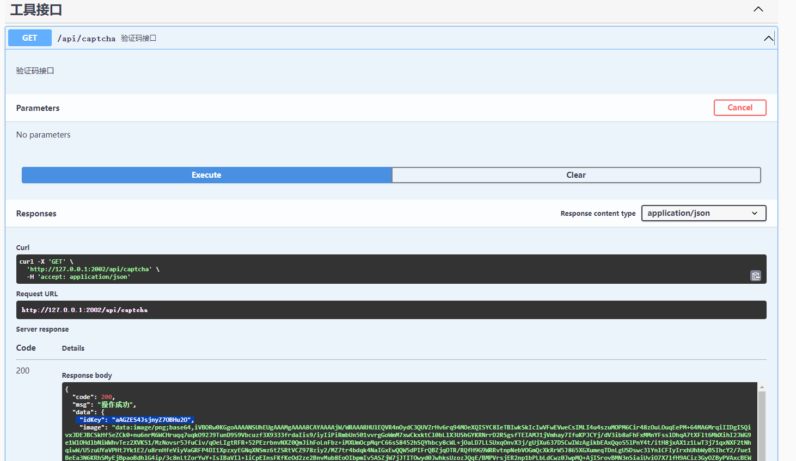
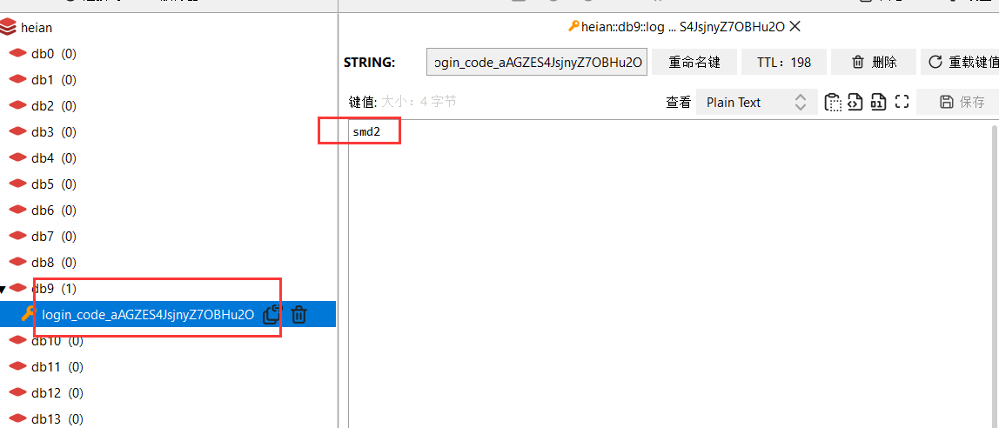
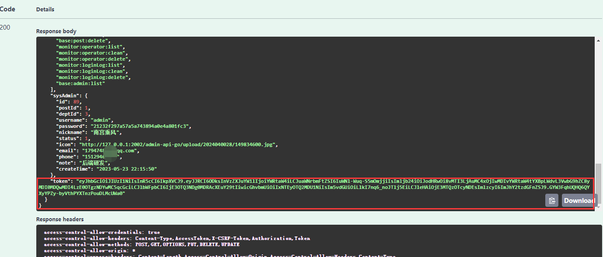
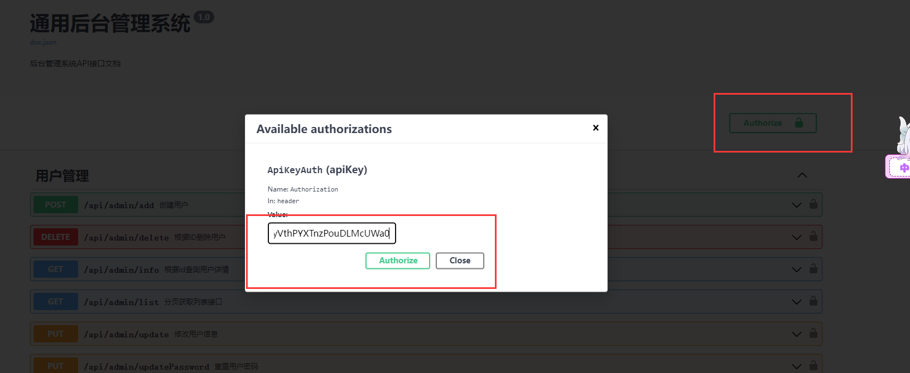
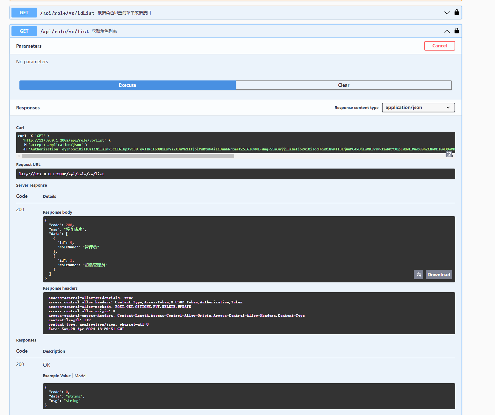

# Go开发后台管理系统

## 项目简介

一个综合性的管理系统后端框架，主要包括以下核心功能：

1. **用户信息管理**：维护用户的基本信息，包括添加、编辑和删除用户，以及查看用户详情。支持用户状态管理，如激活、禁用等操作。
2. **角色信息管理**：定义不同的角色，并为每个角色分配相应的权限和责任。角色管理允许您精确控制用户可以访问和操作的系统部分。
3. **菜单信息管理**：配置和维护应用程序的导航菜单。这包括菜单的结构、显示逻辑、以及与角色权限的关联，确保用户界面的动态响应性和个性化。
4. **部门信息管理**：管理组织内各个部门的信息，支持部门的层次结构和部门之间的关系，为资源分配和权限管理提供结构化视图。
5. **岗位信息管理**：定义公司内的各种岗位职责和要求，岗位与员工的对应关系，以及岗位在组织内的级别和分类。
6. **操作日志记录**：记录用户在系统中的各项操作，包括时间、操作类型、操作内容和操作者信息。这对于审计、回溯和监控系统使用情况至关重要。
7. **登录日志记录**：跟踪用户的登录详情，如登录时间、IP地址和登录结果，增强系统的安全性和帮助识别非授权的访问尝试。
8. **个人信息管理**：允许用户查看和更新他们自己的个人资料信息，如联系方式、密码和个人设置。

这个项目通过提供全面的管理功能，使得组织能够有效地管理其人员和资源，同时通过详细的日志记录功能增強了安全性和透明度。

## 项目技术栈

后端项目为go语言项目

1. **Go语言**：以其并发机制和高效的性能著称，是构建可靠和可扩展后端服务的理想选择。
2. **Gin框架**：一个高性能的HTTP Web框架，通过处理请求和路由的简洁API加快开发速度，并提升应用性能。
3. **GORM**：一个开发者友好的ORM库，用于处理数据库操作，支持开发者以更加对象化的方式进行数据操作，简化数据的CRUD操作。
4. **Swagger**：通过Swagger UI提供自动生成的API文档，使得API的测试和前后端的集成更加方便和高效。
5. **Redis**：作为数据缓存解决方案，提升应用的响应速度和处理能力，特别是在处理大量并发请求时。
6. **JWT (JSON Web Tokens)**：安全地处理用户认证和会话管理，支持跨域身份验证的同时，确保数据的安全传输。
7. **Base64Captcha**：为系统提供验证码功能，增加安全性，有效防止恶意攻击和自动化脚本。
8. **MySQL**：作为关系型数据库管理系统，负责存储所有数据，保证数据的持久化和事务性。
9. **YAML**：用于配置文件，以其可读性高和易于使用的特性，优化配置管理流程。

此外，项目采用前后端完全分离的开发方式，前端独立于后端，通过API进行数据交互，增加了项目的灵活性和可维护性。这种架构使得团队可以更专注于各自的开发任务，优化资源分配，加速开发周期。

## 项目结构



```
└─admin-go-api
    ├─.idea
    ├─api  业务功能实现
    │  ├─controller  数据接口层
    │  ├─dao   操作数据库
    │  ├─entity  结构层
    │  └─service  数据服务层（业务逻辑）
    ├─common  # 通用的工具
    │  ├─config  配置文件
    │  ├─constant  常用变量
    │  ├─result 状态码
    │  └─util 工具
    ├─docs  swag 生成的文件
    ├─images
    ├─middleware  #中间件
    ├─pkg  #工具类
    │  ├─db Mysql
    │  ├─jwt 用户认证
    │  ├─log 日志记录
    │  └─redis 缓存
    └─router  #路由接口

```

## 测试

项目启动访问这个地址，访问swag的页面

http://127.0.0.1:2002/swagger/index.html#/



## 使用方式

账号/密码：admin/admin

### 1、在 /api/captcha  获取

```
 "idKey": "aAGZES4JsjnyZ7OBHu2O",
```



### 2、在redis查询生成的验证码



### 在 /api/login 登录用户，获取Token

```json
{
  "idKey": "aAGZES4JsjnyZ7OBHu2O",
  "image": "smd2",
  "password": "admin",
  "username": "admin"
}
```



### Swag填入Token调试





